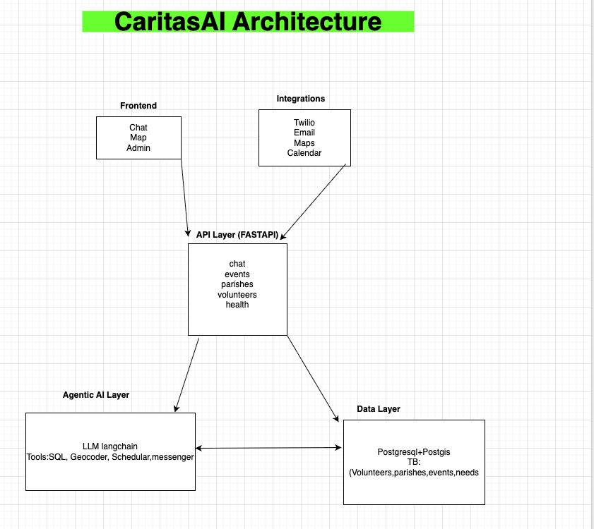

# CaritasAI – System Design (Team - LightBridge)

## 1. Purpose & Scope
CaritasAI is an Agentic AI platform that connects Catholic volunteers, parishes, and charities to real-world service opportunities. It uses Large Language Models (LLMs), geospatial data, and lightweight automation to match people who want to help with those who need help. This document describes the high-level architecture, core components, data model, and implementation plan.

## 2. Architecture Overview
CaritasAI follows a service-oriented architecture with a FastAPI backend, an Agentic AI layer for reasoning and action, a geospatial datastore (PostgreSQL + PostGIS), and a web frontend for chat + maps + basic analytics.

- **Frontend**: React (web) UI for chat, map view, and admin dashboard.
- **API Layer**: FastAPI exposes REST endpoints for chat, volunteers, events, and parish data.
- **Agentic AI Layer**: LLM-driven reasoning (LangChain/LangGraph) with tools for DB queries, geocoding, and scheduling.
- **Data Layer**: PostgreSQL + PostGIS for parishes, events, volunteers, and service logs.
- **Integrations**: Twilio (SMS), Email, Google Maps/OpenStreetMap, Calendar.
- **Deployment**: Dockerized services; local dev via VS Code; cloud via AWS EC2.

## 3. Core Components
### 3.1 Frontend
- **Chat Interface**: Natural conversation with the CaritasAI agent.
- **Map View**: Nearby parishes/charities and events, geospatial search, directions deeplinks.
- **Admin Tools**: Event creation, volunteer roster, simple analytics.

### 3.2 API Layer (FastAPI)
- `/chat`: Chat endpoint to the agent (streamed responses).
- `/events`: CRUD for events (list/search by location and date).
- `/parishes`: Parish data CRUD + search by radius.
- `/volunteers`: Registration, preferences, and skills.
- `/health`: Healthcheck endpoint for ops.

### 3.3 Agentic AI Layer
- **LLM Core**: GPT-4/Claude/Mixtral for intent recognition, reasoning, and tone.
- **Orchestration**: LangChain/LangGraph for tool routing, memory, and multi-step planning.
- **Tools/Skills**:
  - SQLTool: Parameterized Postgres/PostGIS queries.
  - Geocoder: Forward/reverse geocoding.
  - Scheduler: Calendar or internal “register me” operation.
  - Messenger: SMS/Email notification sender.
- **Memory**: Vector store (FAISS/Pinecone) for short-term conversation + user preferences.

### 3.4 Data Layer
- **PostgreSQL + PostGIS** with indices on geometry columns for fast radius searches.
- **S3/Blob (optional)** for file assets (flyers, images).
- **Airtable/CSV (optional)** as a stopgap for early event feeds.

## 4. Data Model (Initial)
**Volunteer**(id, name, email, phone, skills[], location_point, availability_json, created_at)  
**Parish**(id, name, address, location_point, contact_email, contact_phone, created_at)  
**Event**(id, parish_id→Parish.id, title, description, start_ts, end_ts, location_point, capacity, tags[], created_at)  
**Registration**(id, volunteer_id→Volunteer.id, event_id→Event.id, status, created_at)  
**Need**(id, parish_id→Parish.id, category, urgency, details, location_point, created_at)  
**MessageLog**(id, user_id, channel, direction, content, created_at)

> Notes:
> - Use `GEOGRAPHY(Point, 4326)` for `location_point` to support distance queries via PostGIS.
> - Create GIST indices on geospatial columns.
> - Tag arrays can be `TEXT[]` with GIN indices for search.

## 5. Request Flows
### 5.1 “I want to help this weekend”
1. Frontend sends user message to `/chat`.
2. Agent extracts intent → timeframe + location.
3. SQLTool queries events within radius and date window.
4. Agent ranks results by proximity, capacity, and user preferences.
5. Response lists 1–3 options + CTA (“Register me”).

### 5.2 “I need help tonight near [address]”
1. Agent identifies a *Need* request and geocodes the address.
2. SQLTool searches nearest parishes/charities with relevant programs.
3. Agent replies with nearest options and phone/email, and optionally triggers Messenger to notify parish admin.

### 5.3 Parish creates an event
1. Admin uses dashboard → POST `/events`.
2. Event saved in DB with geometry.
3. Agent can proactively notify volunteers that match preferences within radius.

## 6. Non-Functional Requirements
- **Security**: API key auth for admin routes, JWT for end-user sessions, rate limiting on `/chat`.
- **Privacy**: Minimal PII; opt-in consent for messaging; encrypted secrets via environment variables.
- **Reliability**: Health checks, logging, retry on external APIs.
- **Performance**: Indexes on geospatial and time columns; paginate list endpoints.
- **Accessibility**: SMS/WhatsApp support to reach low-connectivity users.
- **Internationalization**: Multilingual prompts and UI text.

## 7. DevOps & Deployment
- **Local**: Docker Compose for DB + API; `.env` loaded via `backend/app/core/config.py`.
- **CI**: Lint, type-check, and run tests on push.
- **CD**: Build/push Docker image; deploy to EC2 or container platform.
- **Observability**: Structured logs, basic request metrics, and error alerts.

## 8. Implementation Plan (2 Weeks)
**Week 1**: Repo setup, system design, DB schema, core APIs, agent skeleton.  
**Week 2**: Frontend prototype, geospatial search, agent actions (register/notify), docs & demo.

## 9. Risks & Mitigations
- **LLM Hallucinations** → Constrain with tools, schemas, and deterministic SQL templates.
- **Data Quality** → Start with curated seed data; add admin moderation for events/needs.
- **Adoption Friction** → Support SMS + minimal web UI; few-click onboarding for parishes.

## 10. Future Work
- Multi-diocesan federation; permissions and roles.
- Impact analytics (volunteer hours, service heatmaps).
- Grants/donations integration; partnership APIs.
- Mobile app and offline-first capability.
